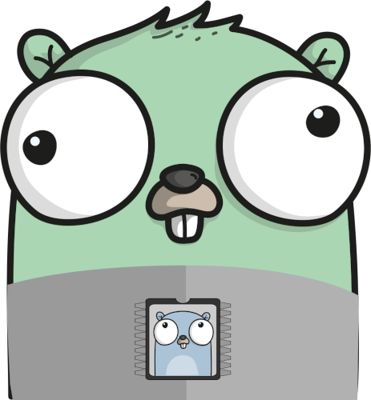
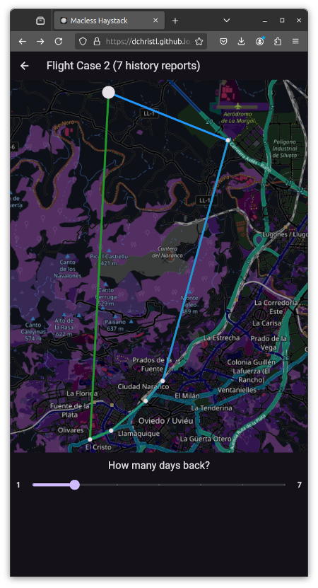
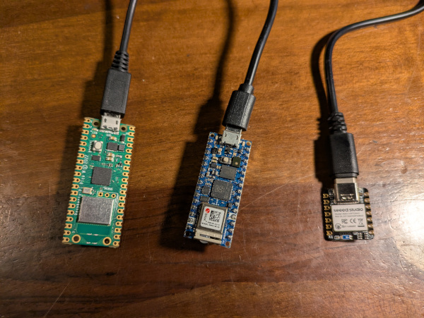
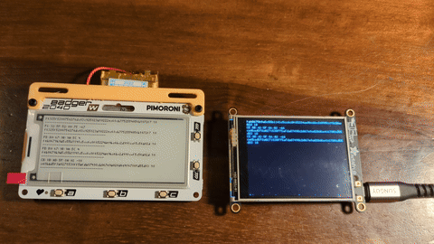

# go-haystack



Go Haystack lets you track personal Bluetooth devices via Apple's massive ["Find My"](https://developer.apple.com/find-my/) network.

It uses [OpenHaystack](https://github.com/seemoo-lab/openhaystack) together with [Macless-Haystack](https://github.com/dchristl/macless-haystack) to help you setup a custom FindMy network with tools written in Go/TinyGo.



## Supported beacon hardware

This package provides firmware written using [TinyGo](https://tinygo.org/) and the [TinyGo Bluetooth package](https://github.com/tinygo-org/bluetooth).



As a result, any of the following hardware devices should work:

- Adafruit Bluefruit boards using nRF SoftDevice - https://github.com/tinygo-org/bluetooth?tab=readme-ov-file#adafruit-bluefruit-boards
- BBC Microbit using nRF SoftDevice - https://github.com/tinygo-org/bluetooth?tab=readme-ov-file#bbc-microbit
- Other Nordic Semi SoftDevice boards - https://github.com/tinygo-org/bluetooth?tab=readme-ov-file#flashing-the-softdevice-on-other-boards
- Boards using the NINA-FW with an ESP32 co-processor - https://github.com/tinygo-org/bluetooth?tab=readme-ov-file#esp32-nina
- Boards such as the RP2040 Pico-W using the CYW43439 co-processor - https://github.com/tinygo-org/bluetooth?tab=readme-ov-file#cyw43439-rp2040-w

You can also run the beacon code on any Linux that has Bluetooth hardware, such as a Raspberry Pi or other embedded system.

The beacon code is located in the [firmware](./firmware/) directory.

## TinyScan

Go Haystack also includes TinyScan, a hardware scanner for local devices.



The TinyScan code is located in the [tinyscan](./tinyscan/) directory.

## How to install

### Apple ID

You must have an Apple-ID with 2FA enabled. Only sms/text message as second factor is supported!

### anisette-v3-server

Start [`anisette-v3-server`](https://github.com/Dadoum/anisette-v3-server)

```bash
docker network create mh-network
docker run -d --restart always --name anisette -p 6969:6969 --volume anisette-v3_data:/home/Alcoholic/.config/anisette-v3 --network mh-network dadoum/anisette-v3-server
```

### macless-haystack

1. Start and set up your Macless Haystack endpoint in interactive mode:

```bash
docker run -it --restart unless-stopped --name macless-haystack -p 6176:6176 --volume mh_data:/app/endpoint/data --network mh-network christld/macless-haystack
```

###### You will be asked for your Apple-ID, password and your 2FA. If you see `serving at port 6176 over HTTP` you have all set up correctly

Hit ctrl-C to exit the process once it has been configured.

2. Restart the macless-haystack server

```bash
docker restart macless-haystack
```

See https://github.com/dchristl/macless-haystack/blob/main/README.md#server-setup for the original instructions.

### go-haystack

Install the go-haystack command line tool

```shell
go install github.com/hybridgroup/go-haystack
```

## How to use

### Scanning for local devices

```shell
go-haystack scan
```

Should return any local devices within range:

```shell
$ go-haystack scan                                                                                                             
FE:B0:67:9B:9A:5C -67 10 feb0679b9a5c55b1141c5cc6c8f65224ae9bc6bc2d998ccf5c56a02d
CE:8B:AD:5F:8A:02 -85 10 ce8bad5f8a0271538ff5afda87498cb067e9a020d6e4167801d55d83
F6:32:5F:52:00:75 -49 10 f6325f520075e27edc03c925823a10222ec68cb7752554056b1072f7
FE:B0:67:9B:9A:5C -66 10 feb0679b9a5c55b1141c5cc6c8f65224ae9bc6bc2d998ccf5c56a02d
CE:8B:AD:5F:8A:02 -81 10 ce8bad5f8a0271538ff5afda87498cb067e9a020d6e4167801d55d83
F6:32:5F:52:00:75 -55 10 f6325f520075e27edc03c925823a10222ec68cb7752554056b1072f7
FE:B0:67:9B:9A:5C -63 10 feb0679b9a5c55b1141c5cc6c8f65224ae9bc6bc2d998ccf5c56a02d
CE:8B:AD:5F:8A:02 -90 10 ce8bad5f8a0271538ff5afda87498cb067e9a020d6e4167801d55d83
F6:32:5F:52:00:75 -50 10 f6325f520075e27edc03c925823a10222ec68cb7752554056b1072f7
FE:B0:67:9B:9A:5C -66 10 feb0679b9a5c55b1141c5cc6c8f65224ae9bc6bc2d998ccf5c56a02d
CE:8B:AD:5F:8A:02 -80 10 ce8bad5f8a0271538ff5afda87498cb067e9a020d6e4167801d55d83
F6:32:5F:52:00:75 -54 10 f6325f520075e27edc03c925823a10222ec68cb7752554056b1072f7
```

### Adding a new device

1. Generate keys for a device

```shell
go-haystack keys DEVICENAME
```

The keys will be saved in a file named `DEVICENAME.keys` and the configuration file for Haystack will be saved in `DEVICENAME.json`. Replace "DEVICENAME" with whatever you want to name the actual device.


2. Flash the hardware with the TinyGo target and the name of your device.

For example:

```shell
go-haystack flash nano-rp2040 DEVICENAME
```

This will use TinyGo to compile the firmware using your keys, and then flash it to the device. See [https://tinygo.org/getting-started/overview/](https://tinygo.org/getting-started/overview/) for more information about TinyGo.


3. Upload the JSON file for that device to your running instance of `macless-haystack` using the web UI.

Point your web browser to [`https://dchristl.github.io/macless-haystack/`](https://dchristl.github.io/macless-haystack/) which is a single-page web application that only reads/writes local data. Click on the link for "Accessories", then on the "+" button. Choose the `DEVICENAME.json` file for your device.

That's it, your device is now setup.

## Objects in your data may be closer than they appear

Eventually, if your device is in range of any iPhone, they will appear in your Macless-Haystack data in the web UI.

Note that it might take a while for the first data to show up.

Have fun, be good!
