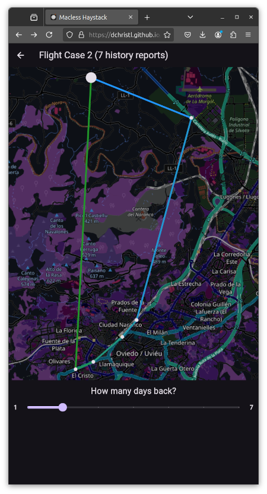
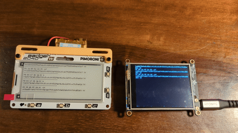

# go-haystack


Go Haystack lets you track personal Bluetooth devices via Apple's massive ["Find My"](https://developer.apple.com/find-my/) network.

It uses [OpenHaystack](https://github.com/seemoo-lab/openhaystack) together with [Macless-Haystack](https://github.com/dchristl/macless-haystack) to help you setup a custom FindMy network with tools written in Go/TinyGo. No Apple hardware required!



## Build Your Own Beacon

This package provides firmware written using [TinyGo](https://tinygo.org/) and the [TinyGo Bluetooth package](https://github.com/tinygo-org/bluetooth).


As a result, any of the following hardware devices should work:

- [Adafruit Bluefruit boards using nRF SoftDevice](https://github.com/tinygo-org/bluetooth?tab=readme-ov-file#adafruit-bluefruit-boards)
- [BBC Microbit using nRF SoftDevice](https://github.com/tinygo-org/bluetooth?tab=readme-ov-file#bbc-microbit)
- [Seeed Studio XIAO nRF52840](https://wiki.seeedstudio.com/XIAO_BLE)
- [Other Nordic Semi SoftDevice boards](https://github.com/tinygo-org/bluetooth?tab=readme-ov-file#flashing-the-softdevice-on-other-boards)
- [Boards using the NINA-FW with an ESP32 co-processor](https://github.com/tinygo-org/bluetooth?tab=readme-ov-file#esp32-nina)
- [Espressif ESP32-C3 and ESP32-S3 boards that use the radio in the chip](https://github.com/tinygo-org/bluetooth?tab=readme-ov-file#esp32), such as the Seeed XIAO ESP32C3 and the XIAO ESP32S3. The targets are `xiao-esp32c3`, `xiao-esp32s3`, `esp32c3-supermini`, `esp32s3-supermini`, `esp32c3-generic`, `esp32s3-generic`, `qtpy-esp32c3` and `m5stamp-c3`. These boards need TinyGo 0.42 or later.
- [Boards such as the RP2040 Pico-W using the CYW43439 co-processor](https://github.com/tinygo-org/bluetooth?tab=readme-ov-file#cyw43439-rp2040-w)

The beacon code is located in this repository in the [firmware](./firmware/) directory.

## Battery Powered Beacons

A beacon on a battery must use as little current as possible. Three settings help,
and all of them are off by default, because each one has a condition.

Turn the serial port off. The firmware then does not start the USB peripheral, which
uses current for no purpose on a battery. Do this for every battery build:

```
tinygo flash -target xiao-ble -serial=none -ldflags="-X main.AdvertisingKey='$ADVKEY'" .
```

Turn the DC/DC regulator on. It lowers the current that the radio and the CPU use, but
the board must have the DC/DC inductors. The Seeed XIAO nRF52840, the nice!nano v2 and
the Adafruit Feather nRF52840 all have them. The regulator is on unless you ask for it
to be off:

```
-ldflags="-X main.AdvertisingKey='$ADVKEY' -X main.DCDC=off"
```

Lower the transmit power. This gives the largest saving after the regulator, but the
device is then found only when a phone is closer to it. The value is in dBm, and the
nRF52840 accepts -40, -20, -16, -12, -8, -4, 0, 2, 3, 4, 5, 6, 7 and 8. An empty value
keeps the default power of the radio, which is 0 dBm:

```
-ldflags="-X main.AdvertisingKey='$ADVKEY' -X main.TxPower=-8"
```

There is a second regulator stage, which the nRF52840 calls REG0. It supplies VDD from
VDDH, so it only exists on a board that is powered through VDDH, such as a nice!nano v2.
Its DC/DC converter is off by default, and you should probably leave it off. A battery
gives about 3.7 V to 4.2 V, and VDD is about 3.0 V to 3.3 V, so there is little to
convert and the converter still costs current to run. Nordic report a case where it
[raised the current instead of lowering it](https://devzone.nordicsemi.com/f/nordic-q-a/117514/enabling-reg0-dcdc-via-reg-dcdcen0-doesn-t-reduce-current-consumption).
Only turn it on if you can measure that it helps:

```
-ldflags="-X main.AdvertisingKey='$ADVKEY' -X main.DCDC0=on"
```

`DCDC`, `DCDC0` and `TxPower` all need a Nordic board that is built with a SoftDevice.
The firmware ignores `DCDC` and `DCDC0` on every other board. `TxPower` prints a message
there, and the radio keeps its default power.

An ESP32-C3 or ESP32-S3 beacon uses much more current than a Nordic beacon. The firmware
does not sleep on these boards, and the Bluetooth package keeps a loop that reads the
radio every 5 milliseconds. Use a larger battery, or use a Nordic board if the device must
run for a long time. The `-serial=none` flag gains almost nothing on these boards, because
the console is part of the USB block that stays on, so `haystack flash -battery` does not
use it there.

### Battery status

The advertisement carries a battery status, which `haystack scan` and the macless-haystack
web UI both show. The firmware reads the battery voltage at start up and then every 15
minutes, and it only restarts the advertisement when the status changes.

| Board | How it reads the battery |
| --- | --- |
| Seeed XIAO nRF52840 | 1M and 510k divider on P0.31, connected by P0.14 |
| nice!nano v2 | VDDH/5 on an internal channel, no divider |
| Adafruit Feather nRF52840 | Two 150k resistors on P0.29, which the board calls A6 |
| Seeed XIAO ESP32C3 | A divider that you add, on an ADC1 pin. See below |
| Seeed XIAO ESP32S3 | A divider that you add, on an ADC1 pin. See below |

Any other board reports a full battery, as before.

#### A battery divider on an ESP32-C3 or ESP32-S3

No XIAO ESP32 board connects the battery to an ADC pin, so you must add a divider of two
resistors from the battery to a pin. Then give the firmware the pin and the ratio, and it
reads the battery in the same way as a Nordic board:

```shell
haystack -batterypin=2 -batterydivider=2/1 flash DEVICENAME xiao-esp32c3
```

The same values with `tinygo` alone:

```
-ldflags="-X main.AdvertisingKey='$ADVKEY' -X main.BatteryPin=2 -X main.BatteryDivider=2/1"
```

`BatteryPin` is the GPIO number and not the name of the pin. On the XIAO ESP32C3, A0 is
GPIO2. On the XIAO ESP32S3, A0 is GPIO1.

`BatteryDivider` is the full resistance divided by the resistance across the pin. Two
resistors of the same value give `2/1`, which you can also write as `2`. A 1M and a 510k
resistor give `1510/510`.

Some rules for the divider:

- The pin must be an ADC1 pin, which is GPIO0 to GPIO4 on the ESP32-C3 and GPIO1 to GPIO10
  on the ESP32-S3. The other pins are ADC2, which shares its hardware with the radio and
  gives noisy values.
- Choose the resistors so that a full 4200 mV battery gives less than about 2500 mV at the
  pin. This needs a ratio of 2 or more, and it keeps the reading in the range where the
  ADC is linear.
- Use large resistors, such as 1M and 1M, because the divider takes current from the
  battery all the time.

The firmware prints a message and reports a full battery if the values are not usable, so
a wrong value cannot stop the beacon.

The ADC on these chips has no calibration, so the voltage can be several percent wrong,
and the thresholds are only 200 mV apart. To correct this, measure the battery with a
multimeter one time, then change `BatteryDivider` until the message agrees with the meter.

The thresholds suit a single cell LiPo, which is full at 4200 mV and empty at about
3300 mV. They are the `battery...Millivolts` constants in
[firmware/battery.go](./firmware/battery.go). A device with a different cell, such as a
coin cell, needs different values there.

## Linux Beacons

You can also run the beacon code on any Linux that has Bluetooth hardware, such as a Raspberry Pi or other embedded system.

The beacon code is the same for embedded Linux as for microcontrollers, and is located in this repo in the [firmware](./firmware/) directory.

## TinyScan

Go Haystack also includes TinyScan, a hardware scanner for local devices.



TinyScan runs on several different microcontrollers boards with Bluetooth and miniature displays, such as those made by [Adafruit](https://www.adafruit.com/) and [Pimoroni](https://shop.pimoroni.com/)

The TinyScan code is located in the [tinyscan](./tinyscan/) directory in this repository.

## How to install

### Apple ID

You must have an Apple-ID with 2FA enabled. Only sms/text message as second factor is supported!

### anisette-v3-server

Start [`anisette-v3-server`](https://github.com/Dadoum/anisette-v3-server)

```bash
docker network create mh-network
docker run -d --restart always --name anisette -p 6969:6969 --volume anisette-v3_data:/home/Alcoholic/.config/anisette-v3 --network mh-network dadoum/anisette-v3-server
```

### macless-haystack

1. Start and set up your Macless Haystack endpoint in interactive mode:

```bash
docker run -it --restart unless-stopped --name macless-haystack -p 6176:6176 --volume mh_data:/app/endpoint/data --network mh-network christld/macless-haystack
```

###### You will be asked for your Apple-ID, password and your 2FA. If you see `serving at port 6176 over HTTP` you have all set up correctly

Hit ctrl-C to exit the process once it has been configured.

2. Restart the macless-haystack server

```bash
docker restart macless-haystack
```

See https://github.com/dchristl/macless-haystack/blob/main/README.md#server-setup for the original instructions.

### go-haystack

Install the go-haystack command line tool

```shell
go install github.com/hybridgroup/go-haystack/cmd/haystack@latest
```

## How to use

### Scanning for local devices

```shell
haystack scan
```

Should return any local devices within range:

```shell
$ haystack scan                                                                                                             
CE:8B:AD:5F:8A:02 -53 ce8bad5f8a0271538ff5afda87498cb067e9a020d6e4167801d55d83 - battery full
FE:B0:67:9B:9A:5C -55 feb0679b9a5c55b1141c5cc6c8f65224ae9bc6bc2d998ccf5c56a02d - battery full
CE:8B:AD:5F:8A:02 -53 ce8bad5f8a0271538ff5afda87498cb067e9a020d6e4167801d55d83 - battery full
CE:8B:AD:5F:8A:02 -53 ce8bad5f8a0271538ff5afda87498cb067e9a020d6e4167801d55d83 - battery full
FE:B0:67:9B:9A:5C -56 feb0679b9a5c55b1141c5cc6c8f65224ae9bc6bc2d998ccf5c56a02d - battery full
CE:8B:AD:5F:8A:02 -53 ce8bad5f8a0271538ff5afda87498cb067e9a020d6e4167801d55d83 - battery full
FE:B0:67:9B:9A:5C -56 feb0679b9a5c55b1141c5cc6c8f65224ae9bc6bc2d998ccf5c56a02d - battery full
CE:8B:AD:5F:8A:02 -53 ce8bad5f8a0271538ff5afda87498cb067e9a020d6e4167801d55d83 - battery full
```

### Adding a new device

1. Generate keys for a device

```shell
haystack keys DEVICENAME
```

The keys will be saved in a file named `DEVICENAME.keys` and the configuration file for Haystack will be saved in `DEVICENAME.json`. Replace "DEVICENAME" with whatever you want to name the actual device.


2. Flash the hardware with the TinyGo target and the name of your device.

For example:

```shell
haystack flash DEVICENAME nano-rp2040
```

This will use TinyGo to compile the firmware using your keys, and then flash it to the device. See [https://tinygo.org/getting-started/overview/](https://tinygo.org/getting-started/overview/) for more information about TinyGo.

For a device on a battery, add `-battery`, which turns the serial port off. Add
`-txpower` to lower the radio transmit power, which saves more current but shortens
the range. On an ESP32-C3 or ESP32-S3 board, add `-batterypin` and `-batterydivider` to
read the battery. All flags go before the subcommand. See
[Battery Powered Beacons](#battery-powered-beacons).

```shell
haystack -battery -txpower=-8 flash DEVICENAME xiao-ble
```


3. Upload the JSON file for that device to your running instance of `macless-haystack` using the web UI.

Point your web browser to [`https://dchristl.github.io/macless-haystack/`](https://dchristl.github.io/macless-haystack/) which is a single-page web application that only reads/writes local data. Click on the link for "Accessories", then on the "+" button. Choose the `DEVICENAME.json` file for your device.

That's it, your device is now setup.

## Objects in your data may be closer than they appear

Eventually, if your device is in range of any iPhone, they will appear in your Macless-Haystack data in the web UI.

Note that it might take a while for the first data to show up.

Have fun, be good!
