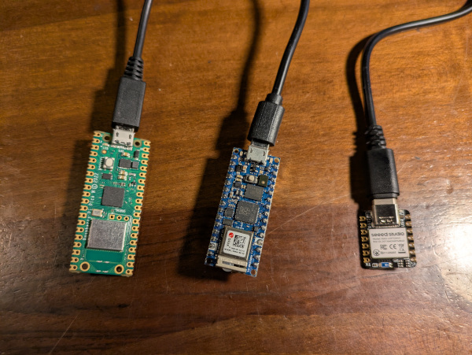

# Firmware

Any device supported by the [TinyGo Bluetooth package](https://github.com/tinygo-org/bluetooth) can be used to create a beacon recognized by OpenHaystack.



As a result, any of the following hardware devices should work:

- [Adafruit Bluefruit boards using nRF SoftDevice](https://github.com/tinygo-org/bluetooth?tab=readme-ov-file#adafruit-bluefruit-boards)
- [BBC Microbit using nRF SoftDevice](https://github.com/tinygo-org/bluetooth?tab=readme-ov-file#bbc-microbit)
- [Seeed Studio XIAO nRF52840](https://wiki.seeedstudio.com/XIAO_BLE)
- [Other Nordic Semi SoftDevice boards](https://github.com/tinygo-org/bluetooth?tab=readme-ov-file#flashing-the-softdevice-on-other-boards)
- [Boards using the NINA-FW with an ESP32 co-processor](https://github.com/tinygo-org/bluetooth?tab=readme-ov-file#esp32-nina)
- [Espressif ESP32-C3 and ESP32-S3 boards that use the radio in the chip](https://github.com/tinygo-org/bluetooth?tab=readme-ov-file#esp32), such as the Seeed XIAO ESP32C3 and the XIAO ESP32S3. The targets are `xiao-esp32c3`, `xiao-esp32s3`, `esp32c3-supermini`, `esp32s3-supermini`, `esp32c3-generic`, `esp32s3-generic`, `qtpy-esp32c3` and `m5stamp-c3`. These boards need TinyGo 0.42 or later.
- [Boards such as the RP2040 Pico-W using the CYW43439 co-processor](https://github.com/tinygo-org/bluetooth?tab=readme-ov-file#cyw43439-rp2040-w)

## How to flash

You can use the `haystack flash` command to flash any of the supported boards. They are using the `tinygo` command to get their work done, so you must also have TinyGo installed.

## Battery Powered Beacons

A beacon on a battery must use as little current as possible. Three settings help,
and all of them are off by default, because each one has a condition.

Turn the serial port off. The firmware then does not start the USB peripheral, which
uses current for no purpose on a battery. Do this for every battery build:

```
tinygo flash -target xiao-ble -serial=none -ldflags="-X main.AdvertisingKey='$ADVKEY'" .
```

Turn the DC/DC regulator on. It lowers the current that the radio and the CPU use, but
the board must have the DC/DC inductors. The Seeed XIAO nRF52840, the nice!nano v2 and
the Adafruit Feather nRF52840 all have them. The regulator is on unless you ask for it
to be off:

```
-ldflags="-X main.AdvertisingKey='$ADVKEY' -X main.DCDC=off"
```

Lower the transmit power. This gives the largest saving after the regulator, but the
device is then found only when a phone is closer to it. The value is in dBm, and the
nRF52840 accepts -40, -20, -16, -12, -8, -4, 0, 2, 3, 4, 5, 6, 7 and 8. An empty value
keeps the default power of the radio, which is 0 dBm:

```
-ldflags="-X main.AdvertisingKey='$ADVKEY' -X main.TxPower=-8"
```

There is a second regulator stage, which the nRF52840 calls REG0. It supplies VDD from
VDDH, so it only exists on a board that is powered through VDDH, such as a nice!nano v2.
Its DC/DC converter is off by default, and you should probably leave it off. A battery
gives about 3.7 V to 4.2 V, and VDD is about 3.0 V to 3.3 V, so there is little to
convert and the converter still costs current to run. Nordic report a case where it
[raised the current instead of lowering it](https://devzone.nordicsemi.com/f/nordic-q-a/117514/enabling-reg0-dcdc-via-reg-dcdcen0-doesn-t-reduce-current-consumption).
Only turn it on if you can measure that it helps:

```
-ldflags="-X main.AdvertisingKey='$ADVKEY' -X main.DCDC0=on"
```

`DCDC`, `DCDC0` and `TxPower` all need a Nordic board that is built with a SoftDevice.
The firmware ignores `DCDC` and `DCDC0` on every other board. `TxPower` prints a message
there, and the radio keeps its default power.

An ESP32-C3 or ESP32-S3 beacon uses much more current than a Nordic beacon. The firmware
does not sleep on these boards, and the Bluetooth package keeps a loop that reads the
radio every 5 milliseconds. Use a larger battery, or use a Nordic board if the device must
run for a long time. The `-serial=none` flag gains almost nothing on these boards, because
the console is part of the USB block that stays on, so `haystack flash -battery` does not
use it there.

### Battery status

The advertisement carries a battery status, which `haystack scan` and the macless-haystack
web UI both show. The firmware reads the battery voltage at start up and then every 15
minutes, and it only restarts the advertisement when the status changes.

| Board | How it reads the battery |
| --- | --- |
| Seeed XIAO nRF52840 | 1M and 510k divider on P0.31, connected by P0.14 |
| nice!nano v2 | VDDH/5 on an internal channel, no divider |
| Adafruit Feather nRF52840 | Two 150k resistors on P0.29, which the board calls A6 |
| Seeed XIAO ESP32C3 | A divider that you add, on an ADC1 pin. See below |
| Seeed XIAO ESP32S3 | A divider that you add, on an ADC1 pin. See below |

Any other board reports a full battery, as before.

#### A battery divider on an ESP32-C3 or ESP32-S3

No XIAO ESP32 board connects the battery to an ADC pin, so you must add a divider of two
resistors from the battery to a pin. Then give the firmware the pin and the ratio, and it
reads the battery in the same way as a Nordic board:

```shell
haystack -batterypin=2 -batterydivider=2/1 flash DEVICENAME xiao-esp32c3
```

The same values with `tinygo` alone:

```
-ldflags="-X main.AdvertisingKey='$ADVKEY' -X main.BatteryPin=2 -X main.BatteryDivider=2/1"
```

`BatteryPin` is the GPIO number and not the name of the pin. On the XIAO ESP32C3, A0 is
GPIO2. On the XIAO ESP32S3, A0 is GPIO1.

`BatteryDivider` is the full resistance divided by the resistance across the pin. Two
resistors of the same value give `2/1`, which you can also write as `2`. A 1M and a 510k
resistor give `1510/510`.

Some rules for the divider:

- The pin must be an ADC1 pin, which is GPIO0 to GPIO4 on the ESP32-C3 and GPIO1 to GPIO10
  on the ESP32-S3. The other pins are ADC2, which shares its hardware with the radio and
  gives noisy values.
- Choose the resistors so that a full 4200 mV battery gives less than about 2500 mV at the
  pin. This needs a ratio of 2 or more, and it keeps the reading in the range where the
  ADC is linear.
- Use large resistors, such as 1M and 1M, because the divider takes current from the
  battery all the time.

The firmware prints a message and reports a full battery if the values are not usable, so
a wrong value cannot stop the beacon.

The ADC on these chips has no calibration, so the voltage can be several percent wrong,
and the thresholds are only 200 mV apart. To correct this, measure the battery with a
multimeter one time, then change `BatteryDivider` until the message agrees with the meter.

#### The cell type

The default thresholds suit a single cell LiPo, which is full at 4200 mV and empty at
about 3300 mV. A 3 V coin cell never gets above 3500 mV, so it reports a critical
battery for its whole life with these values. Give the cell type instead:

```shell
haystack -batterytype=cr2032 flash DEVICENAME xiao-ble
```

| Type | Full | Medium | Low |
| --- | --- | --- | --- |
| `lipo` (the default) | 3900 mV | 3700 mV | 3500 mV |
| `cr2032` | 2900 mV | 2750 mV | 2600 mV |
| `cr1220` | 2950 mV | 2800 mV | 2650 mV |
| `aa-alkaline` | 2800 mV | 2500 mV | 2200 mV |

The thresholds come from the discharge curve of the cell and not from its capacity in
mAh. A CR2032 and a CR1220 are the same lithium chemistry and have almost the same
curve. The CR1220 has a much smaller capacity, so it is empty much sooner, but the
voltage at which it is empty is nearly the same. Its internal resistance is higher, so
it sags more when the radio transmits, and its thresholds are 50 mV higher for this
reason. `aa-alkaline` is two alkaline cells in series, AA or AAA.

For a cell that is not in the table, give the three voltages in millivolts. They are the
full, medium and low values in that order, and each one must be lower than the one
before:

```shell
haystack -batterythresholds=2900/2750/2600 flash DEVICENAME xiao-ble
```

The same values with `tinygo` alone:

```
-ldflags="-X main.AdvertisingKey='$ADVKEY' -X main.BatteryType=cr2032"
-ldflags="-X main.AdvertisingKey='$ADVKEY' -X main.BatteryThresholds=2900/2750/2600"
```

`BatteryThresholds` wins over `BatteryType`. The firmware prints a message and uses the
LiPo values if a value is not usable, so a wrong value cannot stop the beacon.

A 3 V coin cell on an ESP32-C3 or ESP32-S3 board often needs no divider, because it is
already below the 2500 mV that the ADC reads well. Give `-batterydivider=1/1` to read the
pin directly.


## Technical details

When the `haystack flash` command is used, it runs TinyGo to perform the actual flashing of the hardware.

For example:

```shell
tinygo flash -target nano-rp2040 -ldflags="-X main.AdvertisingKey='SGVsbG8sIFdvcmxkIQ=='" .
```
